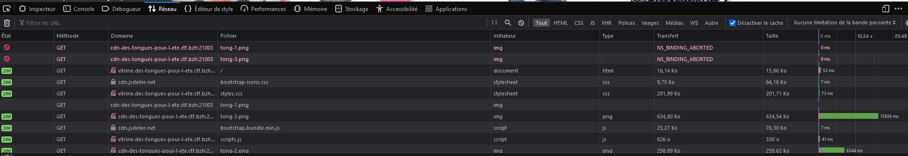
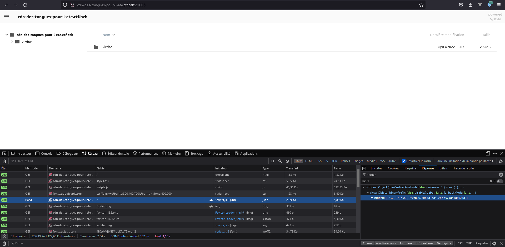
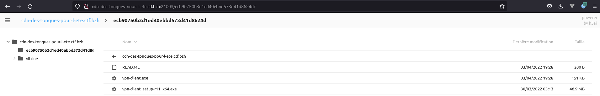
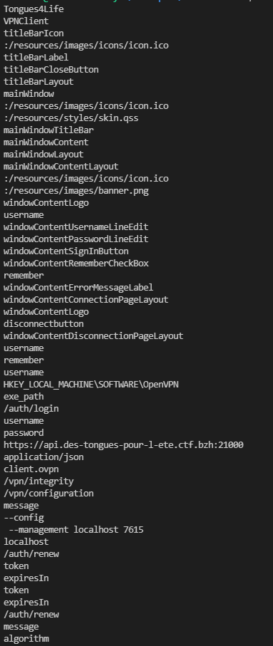
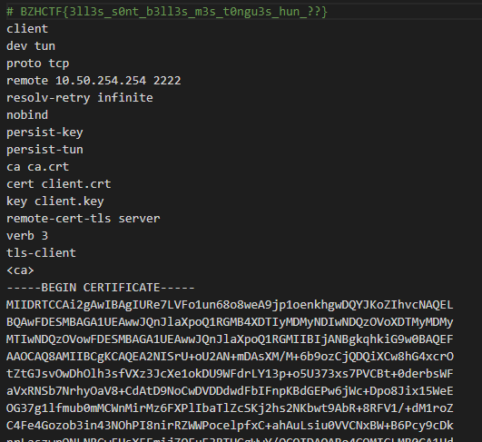

# Des tongues pour l'été

## Description

En recherche de tongues pour passer un été au top, vous trouvez le site https://vitrine.des-tongues-pour-l-ete.ctf.bzh:21000/ sur lequel sont vendus plein de models. Néanmoins, vous trouvez le site relativement lent, et notemment lors du chargement des images. Vous cherchez donc à comprendre ce qui se trame sur le serveur pour qu'il soit si lent...

## Solution

On arrive sur une page de site e-commerce nous permettant de voir différents models de tongues aussi qualitatifs les uns que les autres ! Néanmoins, les images mettent du temps à charger, mais le site, lui, répond parfaitement, les images seraient-elles hébergées autre part ? 

On analyse le réseau, pour voir ça ? 

On découvre que les images sont chargées depuis un autre site : cdn.des-tongues-pour-l-ete.ctf.bzh:21003
On va donc aller voir ce qu'il y a sur ce site... 
On tombe sur un site utilisant le framework _h5ai. La particularité de ce site est qu'il remplace l'indexOf d'origine. On peux donc se demander s'il affiche réellement tout ce qui est à la racine du site ?

En regardant les données que transmet le site, on s'appercoit que le navigateur émet une requete POST : 

Si on regarde le fonctionnement du framework, on s'appercoi qu'il est possible de configurer des dossiers "hidden". Lors de la réponse de la requete POST, toutes ces données sont renvoyées (me demandez pas pourquoi, j'en sais rien... :))
On découvre donc un dossier caché `ecb90750b3d1ed40ebbd573d41d8624d`
que l'on va donc ouvrir ?

Tiens tiens... un client vpn ? On télécharge le client pour voir ? Ca à l'air d'être un truc custom. Un client vpn c'est bien, mais à quoi ça pourrait servir ? 

A s'authentifier, on peut donc voir si le client communique avec l'exterieur, par wireshark pour essayer de trouver l'endpoint d'authentification, mais celle-ci nous renvois "Maintenance de l'application"... 

Si on va un peu plus loin, il est fort probable que les endpoints soient harcodés dans le client non ? 

`strings -el /vpn-client.exe`

On découvre : 
- /auth/login
- /auth/renew
- /auth/logout
- /vpn/integrity
- /vpn/configuration

Si on analyse le fonctionnement du client, on peux voir qu'il cherche un token JWT, mais ici, cette information n'a aucune utilité car l'authentification est en maintenance... 

Parcontre, on connais les endpoints, ne serais-t-il pas possible de bypass l'authentification ? 
On test differents headers pour voir, des fois qu'un dev s'en servirai pour bypass bypasse l'authentification pour certains tests ? 

`curl -H "X-Forwarded-For: 127.0.0.1" http://api.des-tongues-pour-l-ete.ctf.bzh:21004/vpn/configuration`

TADA! on a un dev qui bosse en local et qui s'est mis un header pour éviter d'avoir a regénérer un token jwt à chaque fois, sauf qu'il l'a laissé en prod'... 

Bienvenue sur le vpn de Tongues4Life

